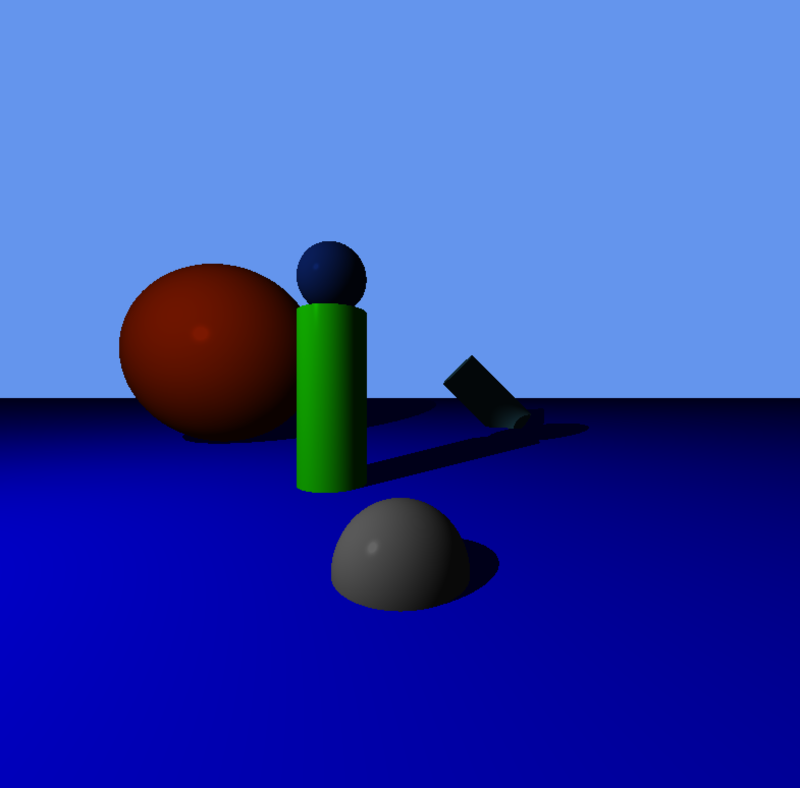

# miniRT
## MiniLibXを用いたレイトレーシングプログラムの実装 (C言語)
- [MiniLibX](https://harm-smits.github.io/42docs/libs/minilibx/getting_started.html)
- カメラ、環境光、点光源、平面、球、円柱
- カメラ位置の移動、複数オブジェクトの表示
- Phongの反射モデル（環境光(定数)、直接光の拡散反射光、直接光の鏡面反射光）

## Example
<p align="center">
  
  
  
  
  
  
  
  
  
  
</p>

## Execution environment
- iMac
- m1 macbook air


## Usage
### compile
```
make
```

### execute
- OK case

```
./miniRT files/my_test/*.rt
./miniRT files/test/*.rt
```

- all OK case

```
make files
```

- NG case

```
./miniRT files/ng/*.rt
```
- all NG case
```
make test
```
